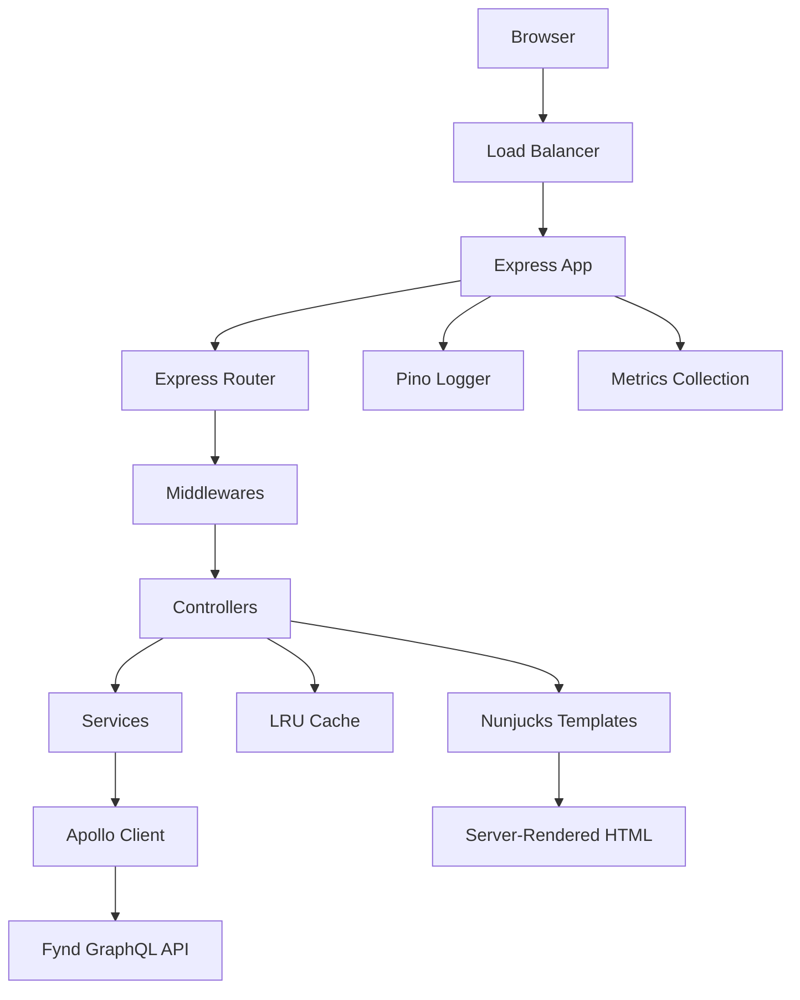
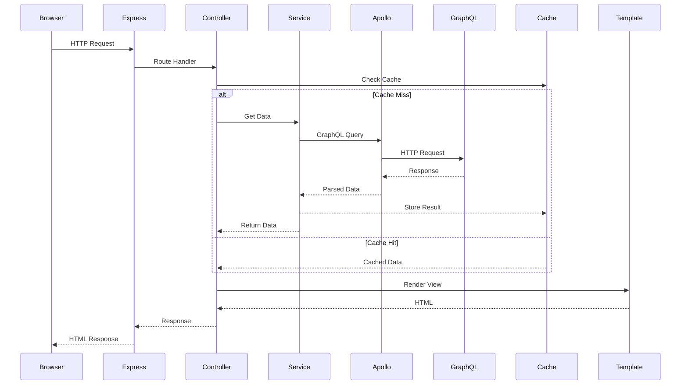
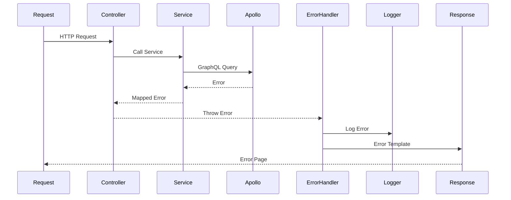

# Architecture Guide

This document provides a detailed overview of the Fynd Storefront SSR architecture, design patterns, and implementation decisions.

## Overview

The Fynd Storefront SSR is built with a **modular, layered architecture** that separates concerns and promotes maintainability. The system follows established patterns for server-side rendering, API integration, and error handling.

## Core Principles

### 1. **Separation of Concerns**
- **Routes**: HTTP routing and request handling
- **Controllers**: Business logic and data orchestration  
- **Services**: GraphQL API integration
- **Views**: Template rendering and presentation
- **Middlewares**: Cross-cutting concerns (auth, logging, caching)

### 2. **Type Safety**
- Full TypeScript implementation
- Generated GraphQL types
- Zod schemas for runtime validation
- Strict compiler settings

### 3. **Error-First Design**
- Centralized error handling
- Proper error taxonomy
- User-safe error messages
- Request tracing and correlation

### 4. **Performance by Default**
- Multi-layer caching strategy
- Efficient GraphQL queries
- Optimized template rendering
- HTTP/2 and compression

## System Architecture



## Layer Details

### 1. HTTP Layer (Routes)

**Location**: `src/routes/`

Routes define the HTTP endpoints and delegate to controllers:

```typescript
// Simple route definition
router.get('/', homeController);
router.get('/api', homeDataController);
```

**Responsibilities**:
- URL pattern matching
- HTTP method handling
- Route-specific middleware
- Controller delegation

### 2. Request Processing (Middlewares)

**Location**: `src/middlewares/`

Middlewares handle cross-cutting concerns:

```typescript
// Middleware pipeline
app.use(requestId);           // Generate correlation ID
app.use(requestLogging);      // Log requests
app.use(securityHeaders);     // Security headers
app.use(rateLimiting);        // Rate limiting
app.use(requestContext);      // Extract context
```

**Key Middlewares**:
- **Request ID**: Generates unique correlation IDs
- **Logging**: Structured request/response logging
- **Security**: Helmet.js security headers
- **Rate Limiting**: Prevents abuse
- **Error Handling**: Centralized error processing

### 3. Business Logic (Controllers)

**Location**: `src/controllers/`

Controllers orchestrate data fetching and response generation:

```typescript
export const homeController = asyncHandler(
  async (req: Request, res: Response): Promise<void> => {
    const context = (req as any).context;
    
    // Parallel data fetching
    const [homeContent, featuredProducts] = await Promise.all([
      ContentService.Home.getHomeContent(context),
      CatalogService.Product.getProducts({ page_size: 8 }, context),
    ]);
    
    // Template rendering
    res.render('pages/home', { homeContent, featuredProducts });
  }
);
```

**Responsibilities**:
- Request validation
- Service orchestration
- Error handling
- Response formatting
- Cache header management

### 4. Data Access (Services)

**Location**: `src/services/`

Services encapsulate GraphQL API interactions:

```typescript
export class ProductService {
  static async getProduct(slug: string, context?: RequestContext) {
    const client = GraphQLClientFactory.createForRequest(context || {});
    const cacheKey = CacheKeyBuilder.product(slug);

    return cache.getOrSet(
      cacheKey,
      async () => {
        const data = await GraphQLClientFactory.executeQuery(
          client,
          GET_PRODUCT,
          { slug },
          context
        );
        return data.product;
      },
      Config.cacheTtl,
      context?.traceId
    );
  }
}
```

**Responsibilities**:
- GraphQL query execution
- Response caching
- Error mapping
- Data transformation

### 5. GraphQL Integration (Apollo Client)

**Location**: `src/lib/apollo.ts`

Apollo Client handles GraphQL communication:

```typescript
// Client configuration with links
const link = from([
  createLoggingLink(),        // Request/response logging
  createErrorLink(),          // Error handling
  createCircuitBreakerLink(), // Circuit breaker
  createTimeoutLink(),        // Request timeouts
  createRetryLink(),          // Retry logic
  createAuthLink(),           // Authentication
  createHttpLinkWithFetch(),  // HTTP transport
]);
```

**Features**:
- Request/response logging
- Circuit breaker pattern
- Retry with exponential backoff
- Request timeouts
- Error mapping
- Authentication headers

### 6. Presentation Layer (Views)

**Location**: `src/views/`

Nunjucks templates render server-side HTML:

```html
<!-- Template inheritance -->


<!-- Component inclusion -->


<!-- Data binding -->
<h1>{{ product.name }}</h1>
<p>{{ product.price.selling.min | price }}</p>
```

**Template Structure**:
- **Layouts**: Base page structure
- **Pages**: Route-specific templates
- **Partials**: Reusable components
- **Macros**: Template functions

## Design Patterns

### 1. **Factory Pattern**

Used for creating request-scoped Apollo clients:

```typescript
export class GraphQLClientFactory {
  static createForRequest(context: RequestContext): ApolloClient<any> {
    return createApolloClient(context);
  }
}
```

### 2. **Builder Pattern**

Used for cache key generation:

```typescript
export class CacheKeyBuilder {
  static product(slug: string, variant?: string): string {
    return variant ? `product:${slug}:${variant}` : `product:${slug}`;
  }
}
```

### 3. **Strategy Pattern**

Used for error handling:

```typescript
export class GraphQLErrorMapper {
  static mapApolloError(error: ApolloError): AppError {
    // Different strategies for different error types
    if (error.networkError) return this.mapNetworkError(error);
    if (error.graphQLErrors) return this.mapGraphQLError(error);
    return new InternalError();
  }
}
```

### 4. **Observer Pattern**

Used for logging and metrics:

```typescript
// Request lifecycle events
res.on('finish', () => {
  logger.info({ duration, statusCode }, 'Request completed');
});
```

## Data Flow

### 1. **Request Processing Flow**



### 2. **Error Handling Flow**



## Caching Strategy

### 1. **Multi-Layer Caching**

```typescript
// Layer 1: In-Memory LRU Cache
const cached = cache.get(key);
if (cached) return cached;

// Layer 2: GraphQL Query Cache (Apollo)
const result = await client.query({ query, variables });

// Layer 3: HTTP Cache Headers
HttpCacheControl.setHeaders(res, { maxAge: 300 });
```

### 2. **Cache Key Strategy**

```typescript
// Hierarchical cache keys
const keys = {
  product: `product:${slug}`,
  category: `category:${slug}:${filtersHash}`,
  search: `search:${queryHash}:${filtersHash}`,
  graphql: `graphql:${operationName}:${variablesHash}`
};
```

### 3. **Cache TTL Strategy**

- **Static Content**: 4+ hours (categories, navigation)
- **Product Data**: 10 minutes (product details, listings)
- **Search Results**: 3 minutes (dynamic, user-specific)
- **Home Content**: 5 minutes (frequently updated)

## Security Considerations

### 1. **Input Validation**

```typescript
// Zod schema validation
const productParams = z.object({
  slug: z.string().min(1).max(100).regex(/^[a-z0-9-]+$/)
});

const { slug } = productParams.parse(req.params);
```

### 2. **Error Sanitization**

```typescript
// Never expose sensitive data in errors
export class AppError extends Error {
  toJSON() {
    return {
      code: this.code,
      message: this.message, // User-safe message only
      statusCode: this.statusCode,
      // Stack traces only in development
      ...(process.env.NODE_ENV === 'development' && {
        stack: this.stack
      })
    };
  }
}
```

### 3. **Security Headers**

```typescript
// Helmet.js configuration
helmet({
  contentSecurityPolicy: {
    directives: {
      defaultSrc: ["'self'"],
      scriptSrc: ["'self'"],
      styleSrc: ["'self'", "'unsafe-inline'"],
      imgSrc: ["'self'", "data:", "https:"]
    }
  }
})
```

## Performance Optimizations

### 1. **Parallel Data Fetching**

```typescript
// Fetch data in parallel, not sequentially
const [homeContent, navigation, products] = await Promise.all([
  ContentService.Home.getHomeContent(context),
  ContentService.Navigation.getNavigation(context),
  CatalogService.Product.getProducts(params, context)
]);
```

### 2. **Efficient GraphQL Queries**

```typescript
// Use fragments for reusable query parts
const GET_PRODUCT = gql`
  query GetProduct($slug: String!) {
    product(slug: $slug) {
      ...ProductBasicFragment
      variants {
        ...ProductBasicFragment
      }
    }
  }
  ${PRODUCT_BASIC_FRAGMENT}
`;
```

### 3. **Template Optimization**

```html
<!-- Lazy load images -->


<!-- Responsive images -->

```

## Monitoring and Observability

### 1. **Structured Logging**

```typescript
// Correlation ID tracking
const logger = requestLogger(req.id);
logger.info({
  operation: 'product_fetch',
  productId: product.uid,
  duration: timer.end(),
  cacheHit: fromCache
}, 'Product data retrieved');
```

### 2. **Error Tracking**

```typescript
// Error context collection
logger.error({
  err: error,
  traceId: context.traceId,
  operation: 'graphql_query',
  variables: hashVariables(variables)
}, 'GraphQL operation failed');
```

### 3. **Performance Metrics**

```typescript
// Request timing
const timer = new Timer(logger, 'controller.home');
// ... processing ...
const duration = timer.end({ cacheHit: true });
```

## Testing Strategy

### 1. **Unit Tests**

- **Controllers**: Mock services, test business logic
- **Services**: Mock Apollo client, test data transformation
- **Utilities**: Test pure functions and error handling

### 2. **Integration Tests**

- **Route Testing**: Test full request/response cycle
- **GraphQL Integration**: Test against real API
- **Template Rendering**: Test view output

### 3. **E2E Tests**

- **Smoke Tests**: Verify all routes render
- **User Flows**: Test critical user journeys
- **Performance Tests**: Verify response times

## Deployment Architecture

### 1. **Container Deployment**

```dockerfile
FROM node:18-alpine
WORKDIR /app
COPY package*.json ./
RUN npm ci --only=production
COPY dist/ ./dist/
COPY public/ ./public/
EXPOSE 3000
CMD ["node", "dist/server.js"]
```

### 2. **Environment Configuration**

```yaml
# Production environment
NODE_ENV: production
PORT: 3000
TRUST_PROXY: true
CACHE_TTL_SECONDS: 600
LOG_LEVEL: warn
PRETTY_LOGS: false
```

### 3. **Health Checks**

```typescript
// Health check endpoint
app.get('/health', (req, res) => {
  res.json({
    status: 'healthy',
    timestamp: new Date().toISOString(),
    uptime: process.uptime(),
    memory: process.memoryUsage(),
    version: process.env.npm_package_version
  });
});
```

This architecture provides a solid foundation for a production-ready storefront with proper separation of concerns, error handling, performance optimization, and monitoring capabilities.
